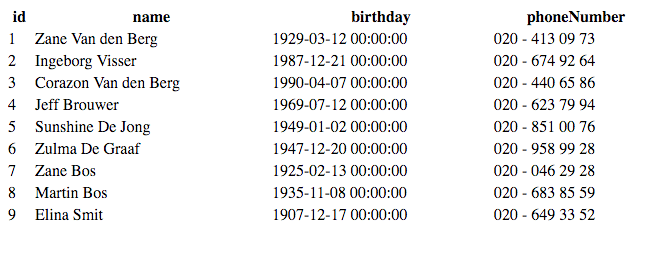

#Example MySQL database

The previous example was a lite databases. We now move over to MySQL, the PHP database mother load.
Almost all website running on PHP use MySQL.

We will be using [SPOD macros](http://old.haxe.org/manual/spod).
Check more info in the [about](about.md).


_The code used in this example is [here](https://github.com/MatthijsKamstra/haxephp/tree/master/11mysql/code)._


## How to start

Create a folder named **foobar** (please use a better name; any name will do) and create folders **bin** and **src**.
See example below:

```
+ foobar
	+ bin
	+ src
		- Main.hx
	- php.hxml
```


## The Main.hx

This example is getting to big to post here, so if you want to check out the complete file go and check out [Main.hx](https://github.com/MatthijsKamstra/haxephp/tree/master/11mysql/code/Main.hx) 


First we need a database, so I wrote a class that creates one for you: `DBStart.hx`.
This class generates random users.

```
	var cnx : sys.db.Connection;
	if( !useMysql )
		// Open a connection
		cnx = sys.db.Sqlite.open("mybase.db");
	else {
		// Open a connection
		cnx = sys.db.Mysql.connect({ 
			host : "localhost",
			port : 3306,
			database : "MyDatabase",
			user : "root",
			pass : "",
			socket : null
		});
	}

	// Set as the connection for our SPOD manager
	sys.db.Manager.cnx = cnx;

	// initialize manager
	sys.db.Manager.initialize();

	// Create the "user" table
	if ( !sys.db.TableCreate.exists(User.manager) ) {
		sys.db.TableCreate.create(User.manager);
	}

	// Fill database with users
	for (i in 0 ... 10) {
		var user = createRandomUser();
		user.insert();
	}
	
	// close the connection and do some cleanup
	sys.db.Manager.cleanup();

	// Close the connection
	cnx.close();

```
The function `createRandomUser()` does what you would expect, if you want to know, check the source code.

A user!  
We have used a `typedef` before, this looks similar.  
The strange stuff here are the types, they are not the default types that Haxe uses.  
Read more about that: [creating-a-spod](http://old.haxe.org/manual/spod#creating-a-spod).

```
import sys.db.Types;

class User extends sys.db.Object {
    public var id : SId;
    public var name : SString<32>;
    public var birthday : SDate;
    public var phoneNumber : SNull<SText>;
}

```

Now we have a database, lets check out the code to get the data from the database:

`Main.hx`

```
	// initialize the connection
	var useMysql = true;
	var isDummyData = false;

	// check if file exists
	if(!useMysql){
		if ( ! sys.FileSystem.exists ( "mybase.ddb" ) ){
			// init SQlite database 
			new DBStart(useMysql);
		} 
	} else {
		new DBStart(useMysql);
	}

	var cnx : sys.db.Connection;
	if( !useMysql )
		// Open a connection
		cnx = sys.db.Sqlite.open("mybase.db");
	else {
		// Open a connection
		cnx = sys.db.Mysql.connect({ 
			host : "localhost",
			port : 3306,
			database : "MyDatabase",
			user : "root",
			pass : "",
			socket : null
		});
	}

	// Set as the connection for our SPOD manager
	sys.db.Manager.cnx = cnx;

	// initialize manager
	sys.db.Manager.initialize();

	// for (i in 0 ... User.manager.all().length) {
	//  var _user = User.manager.get(i);        
	//  if(_user != null) trace(_user.name);
	// }    

	createList();

	// close the connection and do some cleanup
	sys.db.Manager.cleanup();

	// Close the connection
	cnx.close();
```


## The Haxe build file, php.hxml

There are a lot of different arguments that you are able to pass to the Haxe compiler.
Set these arguments into a text file of one per line with the extension hxml. This file passes it directly to the Haxe compiler as a build script.

```
# // php.hxml
-cp src
-main Main
-php bin/www
-dce full
```


## Build PHP with Haxe

To finish and see what we have, build the file and see the result

1. Open your terminal
2. Open the correct folder with `cd ` where you have saved the `php.hxml` 
3. Type `haxe php.hxml`
4. Press enter


And if everything went according to plan, you should see something similar like this:




You could build everything directly in the terminal.

```
haxe -cp src -main Main -php bin/www -dce full
```

It will have the same result


## More info

- <http://api.haxe.org/sys/db/Sqlite.html>
- <http://old.haxe.org/doc/neko/spod>
- <http://old.haxe.org/manual/spod>


